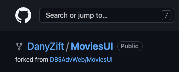

# Report Web API

## Description: 
RapidNews Reports Web API provides CRUD actions for news reports:  
* Get a single report
* Get a list of all reports
* Get a list of reports filtered by all/logged in user and CategoryID 
* Add a new report
* Update an existing report
* Delete a report

It uses MSSQL creating a local reports db called Reports

This webapi is part of the NewsMedia application which can be found on GitHub - https://github.com/BGK-DBS/rapidNews


This document was created with the help of https://www.markdownguide.org/cheat-sheet

## Requirements 

* .NET version 6
* Visual Studio (Preferred) or Visual Studio Code
* Markdown editor plugin

## Download the CodeBase

Fork the project to your own Git Account. The fork button is on the top right of the MoviesUI repo:


A popup will appear asking you where you want to fork to - in my view its my personal account - DanyZift. Pick your own as it will be different on your view:


After clicking on your account it should then redirect to the forked repo. You should then see the following in the top right of the screen:(again your account name will show)



An alternative is to Open the solution in visual studio by selecting the Green Code button and then clicking on the "open with Visual Studio"


A box will appear asking can Github open in visual studio- continue by selecting this:


In visual studio,  select clone at the bottom right hand corner


## Migrations 

### Creating Migration Scripts

* In Visual Studio, Click on the Tools -> Nuget Package Manager -> Package Manager Console
* First migration run the following

```bash
Add-Migration InitialMigration
```

* Verify migrations scripts are run successfully and Migrations folder is created

### Running Migrations Scripts

To run the migration, again open up the Package Manager Console and run the following:

```bash
Update-Database
```

## Running the project locally

Using Visual Studio: 
* Click the IIS express run button in visual studio
* Swagger UI can be accessed on  https://localhost:7011/swagger/index.html


## Future Enhancements
* Additional filtering of reports - IsPublished 


 


